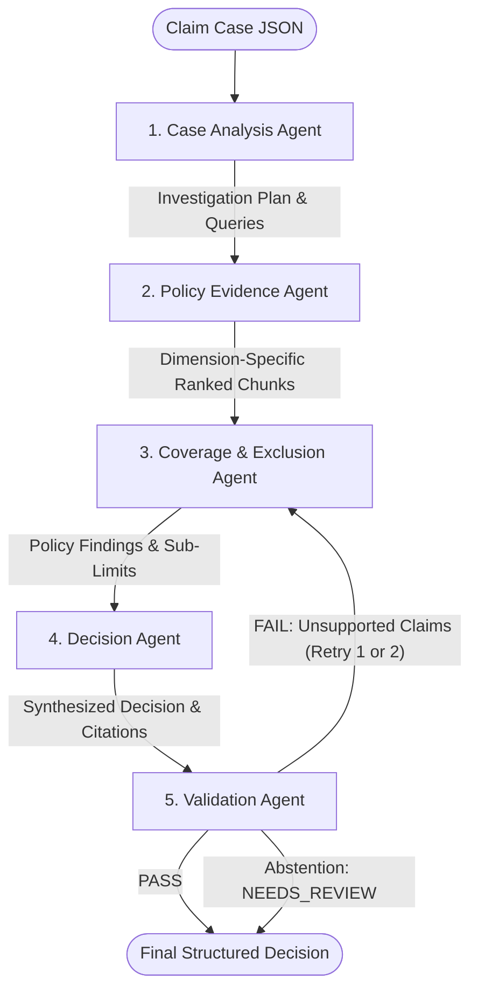

# Architecture & Design Note
## Policy-Aware Multi-Agent RAG Claim Decision Engine
**Universal Sompo General Insurance Co. Ltd. (Policy UNIHLIP18004V011718)**

---

### 1. Architectural Philosophy & Principles
Automated health insurance claim adjudication differs fundamentally from conversational chat or standard question-answering systems. A claim decision directly impacts financial liability and regulatory compliance under IRDAI (Insurance Regulatory and Development Authority of India) mandates.

The system is designed around five core tenets:
1. **The Policy Document is the Sole Truth**: No external medical or insurance assumptions are allowed to invent policy conclusions.
2. **Dimension-Specific Investigation**: A claim cannot be resolved through a single naive search query. Every case must be independently investigated across distinct dimensions: *Coverage Scope*, *Waiting Periods*, *Specific Exclusions*, *Hospital Facility Definitions*, and *Financial Sub-Limits*.
3. **Genuine Multi-Agent Functional Specialization**: Each agent has isolated responsibilities and exchanges typed state schemas (Pydantic v2 / TypedDict) rather than free-form conversational chatter.
4. **Strict Abstention over Hallucinated Liability**: If statutory criteria (e.g. hospital registration, bed counts) or medical necessity are unverified, the system must abstain with `NEEDS_REVIEW` rather than guessing.
5. **Auditable Evidence Provenance & Validation Gate**: Every material statement must cite the source policy PDF, page number, section heading, and exact chunk ID. A dedicated Validation Agent gates all outputs before delivery.

---

### 2. Multi-Agent Topology & State Flow

The orchestration is implemented as a **LangGraph StateGraph** featuring a bounded feedback retry loop:

#### Agent Boundaries & Responsibilities

| Agent | Responsibility Boundary | Input State | Output State |
| :--- | :--- | :--- | :--- |
| **1. Case Analysis Agent** | Normalizes case facts, identifies relevant investigation dimensions, and formulates search queries. **Hard Boundary:** Never makes policy conclusions. | `claim_case` (raw JSON) | `case_facts`, `decision_dimensions`, `investigation_plan`, `missing_fields` |
| **2. Policy Evidence Agent** | Deterministic retrieval specialist (no LLM). Executes parallel hybrid retrieval and cross-encoder reranking per dimension. | `investigation_plan` | `evidence_by_dimension` (RankedEvidence, chunk texts, scores) |
| **3. Coverage & Exclusion Agent** | Core legal/adjudication reasoning. Evaluates each investigation question against retrieved policy clauses. | `case_facts`, `evidence_by_dimension`, `validation_feedback` | `coverage_findings`, `exclusion_findings`, `waiting_period_assessment`, `applicable_limits` |
| **4. Decision Agent** | Synthesizes specialist findings, compiles grounded citations, evaluates missing documents, and determines final status. | All specialist findings | `decision`, `confidence`, `confidence_breakdown`, `key_findings`, `citations` |
| **5. Validation Agent** | Independent quality gate. Verifies that every key finding and sub-limit is textually supported by the cited policy chunk. | `decision`, `key_findings`, `applicable_limits`, `citations` | `validation`: status (`PASS`/`FAIL`), `unsupported_claims`, `feedback` |

---

### 3. Dimension-Specific Hybrid Retrieval Design

#### Why Naive RAG Fails in Insurance
Standard RAG embeds the entire claim description and performs a single top-$k$ vector query. In insurance policies, general hospitalization benefits (e.g. "expenses incurred during hospital stay are covered") will statistically drown out buried specific exclusions (e.g. "joint replacement has a 2-year waiting period" or "facility must have minimum 10 beds").

#### Our Two-Tier Retrieval Architecture
1. **Section-Aware Hierarchical Chunking**:
   - Instead of naive character splitting, PyMuPDF parses section headings (Roman numerals, numbers, uppercase headers).
   - Text is chunked with section hierarchy awareness (~800 tokens max, 100 token overlap), ensuring numbered exclusion lists and definition blocks remain intact.
   - Metadata recorded per chunk: `chunk_id`, `page`, `section`, `heading_path`, `token_count`.
2. **Dimension-Isolated Hybrid Passes**:
   - The Case Analysis Agent generates independent queries for each dimension (e.g. 2 queries for *Waiting Period*, 2 for *Room Rent Limits*, 2 for *Hospital Definition*).
   - Each dimension runs through:
     - **Dense Semantic Retrieval**: `BAAI/bge-small-en-v1.5` embeddings in FAISS `IndexFlatIP` (cosine normalized).
     - **Sparse Lexical Retrieval**: `bm25s` with Porter stemming and English stopword filtering.
     - **Reciprocal Rank Fusion (RRF)**: $RRF(d) = \sum_{m} \frac{1}{60 + r_m(d)}$ combining sparse and dense rankings.
     - **Cross-Encoder Reranking**: `cross-encoder/ms-marco-MiniLM-L-6-v2` re-scoring query-chunk pairs.
   - Merged per dimension and deduplicated by `chunk_id`.

---

### 4. Deterministic Non-Probabilistic Confidence Scoring

LLM-generated probabilities are notoriously uncalibrated. Our system computes a deterministic **Observable Signal Confidence Score**:

$$\text{Confidence} = 0.30 \cdot S_{\text{evidence}} + 0.25 \cdot S_{\text{citation}} + 0.15 \cdot S_{\text{retrieval}} + 0.20 \cdot S_{\text{validation}} + 0.10 \cdot S_{\text{critical}}$$

- $S_{\text{evidence}}$: Fraction of investigated dimensions with authoritative supporting policy clauses.
- $S_{\text{citation}}$: Proportion of key findings with direct chunk-level citations.
- $S_{\text{retrieval}}$: Mean cross-encoder rerank score of retrieved top passages.
- $S_{\text{validation}}$: 1.0 if passed on first attempt; 0.5 if required retry; 0.0 if failed.
- $S_{\text{critical}}$: 1.0 if all critical fields and documents are verified; **forced to 0.0 if critical evidence is missing or unverified**.

---

### 5. Strict Abstention & Safety Architecture

In accordance with IRDAI guidelines, automated liability approval requires complete evidentiary verification:
1. **Hospital Verification**: If `hospital_registered` is `null` or `false`, or if inpatient beds $< 10$, the claim cannot be cleared. The Decision Agent immediately issues `NEEDS_REVIEW`.
2. **Medical Necessity**: If admission is purely diagnostic or observational without confirmed pathological diagnosis (e.g., CUST-001), automated approval is withheld for medical referee review.
3. **Missing Billing Records**: If the claimant task requires itemized assessment but bills are missing (e.g., PUB-006), the system abstains rather than inventing room rent allocations.

---

### 6. Architectural Trade-offs

| Design Decision | Chosen Approach | Alternative Considered | Rationale & Trade-off |
| :--- | :--- | :--- | :--- |
| **Agent Topology** | LangGraph sequential pipeline with validation feedback | Autonomous agent swarm / conversational loop | Predictable latency, auditable step-by-step traces, guaranteed termination without runaway token consumption. |
| **Retrieval Grouping** | Dimension-specific retrieval passes | Single merged vector search | Prevents general cover clauses from obscuring specific exclusions; trade-off is multiple retrieval passes (~1.8s overhead). |
| **Confidence Scoring** | Observable composite formula | LLM self-reported probability | Transparent, reproducible, and verifiable; not a frequentist statistical distribution. |
| **Validation Handling** | Immediate termination on `NEEDS_REVIEW` | Retrying `NEEDS_REVIEW` in coverage loop | Missing external files cannot be resolved by LLM retries; saves ~40s of redundant re-prompting. |

